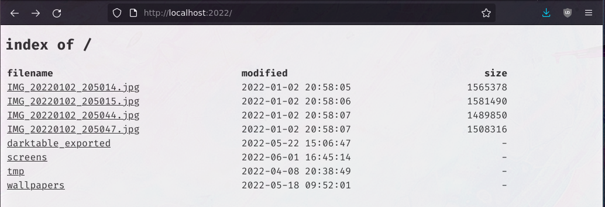

## ShareDir

ShareDir allows you to share a single directory over the web quickly and safely. Just run `sharedir` to share your current directory or run `sharedir path/to/dir` to share another directory.

By default, the HTTP server is started on [localhost:2022](http://localhost:2022). For all available options, run `sharedir -h`.

